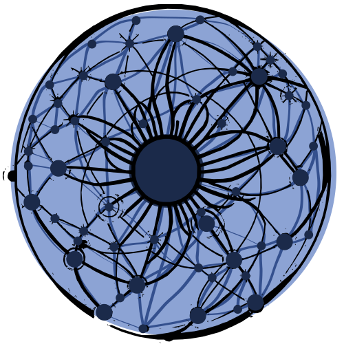

<p align="center">
  
</p>

<h1 align="center">SplatDB</h1>

<p align="center">
Vector search with uncertainty awareness. Knowledge graph + HNSW + GPU in a single Rust binary.
</p>

[](https://github.com/schwabauerbriantomas-gif/splatdb)
[](LICENSE)
[](https://www.rust-lang.org/)
[]()
[]()

---

<p align="center">
  <a href="https://github.com/schwabauerbriantomas-gif/splatdb/releases/download/v2.5.0/splatdb-explainer.mp4">
    
  </a>
</p>

> **🎬 60-second explainer** — Gaussian Splatting, HRM2 retrieval, and real benchmarks in under a minute.

---

## Why SplatDB?

SplatDB is **not** a Faiss competitor on raw QPS. If you need the fastest possible brute-force ANN on a single metric, Faiss wins. SplatDB's differentials are:

- **Uncertainty-aware retrieval**: Queries return confidence scores derived from κ (concentration). Ambiguous or out-of-distribution queries get flagged as "low confidence." No other vector DB does this.
- **GraphSplat hybrid search**: Vector similarity + knowledge graph traversal in one engine. LangChain and LlamaIndex typically need 3 separate tools (vector store, graph DB, fusion layer) to achieve the same result.
- **Agent memory**: Built-in MCP server for long-term AI agent memory. Connect to Claude in 2 minutes — no glue code needed.
- **Single binary, pure Rust**: No Python runtime, no Java, no Docker dependency. One `cargo build --release` and you're done.

### Comparison

| Feature | SplatDB | Faiss | Pinecone | Qdrant | LanceDB |
|---------|---------|-------|----------|--------|---------|
| Language | Rust | C++ | Go/Rust | Rust | Rust |
| Gaussian Splats | ✅ | — | — | — | — |
| Uncertainty scores | ✅ | — | — | — | — |
| Knowledge Graph | ✅ | — | — | — | — |
| MCP server | ✅ | — | — | — | — |
| Self-hosted | ✅ | ✅ | ❌ | ✅ | ✅ |
| GPU custom kernels (14 total) | PTX | CUDA | Cloud | ❌ | ❌ |
| HNSW | ✅ | ✅ | ✅ | ✅ | ✅ |
| Vector compression | ✅ | ✅ | ✅ | ✅ | ✅ |

> **Honest note**: Faiss remains the gold standard for raw throughput on pure ANN benchmarks. Qdrant and LanceDB are more mature production databases with richer filtering, sharding, and ecosystem integrations. SplatDB's niche is uncertainty-aware retrieval + knowledge graph + agent memory in a single lightweight binary.

---

## Table of Contents

- [Why SplatDB?](#why-splatdb)
- [What Is This?](#what-is-this)
- [Architecture](#architecture)
- [Quick Start](#quick-start)
- [How It Works](#how-it-works)
- [Benchmarks](#benchmarks)
- [Configuration Presets](#configuration-presets)
- [CLI Reference](#cli-reference)
- [MCP Server (AI Agent Integration)](#mcp-server-ai-agent-integration)
- [HTTP API Server](#http-api-server)
- [Rust API](#rust-api)
- [GPU Acceleration](#gpu-acceleration)
- [Knowledge Graph (GraphSplat)](#knowledge-graph-graphsplat)
- [Vector Compression (TurboQuant / PolarQuant)](#vector-compression-turboquant--polarquant)
- [Semantic Memory](#semantic-memory)
- [Verbatim Storage (Planned)](#verbatim-storage-planned)
- [Text Compression (Planned)](#text-compression-planned)
- [Energy-Based Model](#energy-based-model)
- [Module Map](#module-map)
- [Dependencies](#dependencies)
- [Roadmap](#roadmap)
- [Spatial Memory Architecture](#spatial-memory-architecture)
- [License](#license)

---

## What Is This?

SplatDB applies **Gaussian Splatting** — a technique from 3D neural rendering — to vector search. Instead of storing raw embedding vectors, each document is represented as a probabilistic Gaussian (mean μ, opacity α, concentration κ). This enables:

- **Richer similarity semantics** via splat overlap instead of point-to-point distance
- **Natural compression** through distribution parameters (3–8 bit quantization)
- **Uncertainty-aware retrieval** — sparse regions have high energy, guiding active learning
- **Knowledge graph overlay** — typed entities and relations augment vector retrieval

Combined with a two-level KMeans++ retrieval pipeline (HRM2), HNSW incremental indexing, 14 CUDA GPU kernels (6 distance + 8 extended), and hybrid BM25+vector semantic memory, SplatDB provides a full-featured vector search engine in ~29K lines of pure Rust + CUDA.

**Key use cases:**
- AI agent long-term memory (MCP server for Claude, GPT, open-source LLMs)
- Semantic search over document collections
- Knowledge graph construction and retrieval
- GPU-accelerated nearest neighbor search at scale

---

## Architecture

```
┌──────────────────────────────────────────────────────────────────┐
│                        Interfaces                                 │
│         CLI (clap)  │  MCP (stdio JSON-RPC)  │  HTTP API         │
├──────────────────────────────────────────────────────────────────┤
│                                                                   │
│  ┌──────────────┐  ┌──────────────┐  ┌─────────────────────┐    │
│  │ Query Layer   │  │ Semantic     │  │ GraphSplat          │    │
│  │ HRM2 Two-     │  │ Memory       │  │ Knowledge Graph     │    │
│  │ Level         │  │ BM25+Vector  │  │ Hybrid Search +     │    │
│  │ Retrieval     │  │ RRF Fusion   │  │ BFS Traversal       │    │
│  └──────┬───────┘  └──────┬───────┘  └───────┬─────────────┘    │
│         └─────────────────┼──────────────────┘                   │
│                           │                                       │
│  ┌────────────────────────▼────────────────────────────────────┐ │
│  │            Gaussian Splat Embeddings                         │ │
│  │         (mean μ + opacity α + concentration κ)               │ │
│  ├──────────────────────────────────────────────────────────────┤ │
│  │  Compression: TurboQuant / PolarQuant (3–8 bit)              │ │
│  ├──────────────────────────────────────────────────────────────┤ │
│  │  Indexes: HNSW │ LSH │ KMeans++ (coarse → fine)             │ │
│  ├──────────────────────────────────────────────────────────────┤ │
│  │  Persistence: SQLite (WAL)  │  GPU: CUDA PTX (optional)     │ │
│  └─────────────────────────────┴───────────────────────────────┘ │
└──────────────────────────────────────────────────────────────────┘
```

---

## Quick Start

### Prerequisites

- **Rust** 1.56+ (Edition 2021)
- **C compiler** (for SQLite bundling via `rusqlite`)
- **CUDA Toolkit 12.x + MSVC `cl.exe`** (optional, for GPU acceleration)

### Build

```bash
# CPU-only (no GPU dependencies)
cargo build --release

# With CUDA GPU acceleration
cargo build --release --features cuda

# Run tests
cargo test --lib
```

### Run

```bash
# Check engine status
./target/release/splatdb status --verbose

# Search with a query vector
./target/release/splatdb search --query "0.1,0.2,0.3,...,-0.5" -k 10

# Start MCP server for AI agent integration
./target/release/splatdb mcp

# Start HTTP API server
./target/release/splatdb serve --host 0.0.0.0 --port 8199

# Ingest vectors from binary file
./target/release/splatdb ingest --input vectors.bin --n-clusters 100
```

### Binary Format

SplatDB uses a simple binary format for vector data:

```
[ u64: number of rows ] [ u64: number of columns ] [ f32 × rows × cols: data ]
```

---

## How It Works

### Gaussian Splat Embeddings

Traditional vector databases store raw embedding vectors and compute point-to-point distances. SplatDB represents each document as a **probabilistic Gaussian**:

- **μ (mean)**: Position in embedding space — the "center" of the concept
- **α (opacity)**: How strongly this document is represented — akin to importance weight
- **κ (concentration)**: How focused the representation is — high κ means precise, low κ means broad

Similarity is computed as **splat overlap** (integral of two Gaussians), which naturally captures:
- Documents that cover broad topics (low κ) match more queries, but with lower confidence
- Documents that are very specific (high κ) match fewer queries, but with higher precision
- Overlap is symmetric and differentiable — enabling energy-based exploration

### HRM2 Two-Level Retrieval

The query pipeline uses Hierarchical Rejection Mapping (HRM2):

1. **Coarse KMeans++**: Partition all splats into N coarse clusters
2. **Fine KMeans++**: Each coarse cluster has M fine sub-clusters
3. **Probe**: Only search the top P fine clusters relevant to the query
4. **Exact re-rank**: Compute full splat overlap for candidates

This reduces search from O(N) to O(N/P) with minimal recall loss.

### SimCos Embeddings

> ⚠️ **SimCos is for quick demos only.** For production, always use real embeddings (OpenAI, Cohere, MiniLM, etc). SimCos uses trigram hashing — it has no semantic understanding.

When no pre-computed embeddings are provided, SplatDB uses **SimCos** — a similarity-consistent n-gram hashing scheme:

- Character trigrams are extracted from text
- Each trigram is hashed into the embedding dimension
- Overlapping n-grams between two texts produce high cosine similarity
- No model loading required — instant, deterministic, zero dependencies

SimCos is a **toy embedding** useful for quick demos and testing. For production use, pass pre-computed embeddings from your preferred model (OpenAI, Cohere, local transformers, etc.).

### α, κ, and Uncertainty: A Concrete Example

Two documents can share the same mean (μ) but have very different uncertainty profiles:

```
Document A: μ=[0.1, 0.3, ...], κ=50 (precise, narrow topic)
Document B: μ=[0.1, 0.3, ...], κ=5  (broad, covers many sub-topics)

Query: "machine learning"
→ Document A: high overlap score, high confidence → ranked #1
→ Document B: moderate overlap, low confidence → ranked lower, flagged as uncertain
```

A high κ means the document is tightly focused — it matches few queries, but when it matches, you can be confident. A low κ means the document is broad — it matches many queries, but results carry less certainty. This is information no plain vector distance can give you.

### When to Use HRM2 Splats vs HNSW

- **HNSW** is the default for production. It indexes μ vectors directly and achieves 0.995+ recall. α and κ are used during re-ranking for confidence scoring.
- **HRM2 splats** are useful when you need overlap-based similarity (capturing topic breadth), uncertainty estimation, or don't have enough data for a good HNSW graph.
- **Rule of thumb**: Use HNSW for speed, use HRM2 when uncertainty matters.

---

## Benchmarks

All numbers are **measured on real hardware** and independently validated. No simulated or estimated data.

### Methodology

- **Dataset**: SIFT-128 from [ANN-Benchmarks](https://github.com/erikbern/ann-benchmarks) (the industry standard for vector search benchmarking, created by Erik Bernhardsson / ex-Spotify)
- **Subset**: First 10K and 100K vectors from the 1M training set, first 1000 queries from the 10K test set
- **Ground truth**: Computed independently with `sklearn.neighbors.NearestNeighbors` (brute-force, `metric='euclidean'`, `algorithm='brute'`). Verified to match ANN-Benchmarks official GT on overlapping queries (100% agreement at top-10)
- **Hardware**: WSL2 on Intel i7-1255U (CPU only, no GPU), 32GB RAM, single-threaded Rust
- **Tool**: Built-in `bench-hnsw` CLI command — loads vectors, builds HNSW, runs queries in-process (eliminates CLI spawn overhead)
- **HNSW config**: Advanced preset (M=32, ef_construction=400, ef_search=100)
- **Recall metric**: recall@10 — fraction of true top-10 nearest neighbors found by the algorithm
- **Metric note**: HNSW graph is built with cosine similarity, but `find_neighbors_fused()` re-ranks all candidates with exact L2 distance before returning. For SIFT-128 (normalized data), cosine and L2 top-10 overlap is 99.4%, so the metric mismatch does not meaningfully affect results
- **Validation**: Results re-run with a second independently generated GT. Numbers below are from the validated run

### HNSW Search (v2.5 — current)

HNSW graph with persistence (save/load to `hnsw_index.bin`), exact L2 distance re-ranking of candidates. Re-benchmarked April 2026 with CUDA-extended kernel integration.

| Dataset | N | Dim | Build Time | p50 Latency | p95 | p99 | QPS | Recall@10 |
|---------|-------|-----|-----------|-------------|------|------|------|-----------|
| SIFT-128 | 10K | 128 | 124s* | 0.93ms | 1.35ms | 1.66ms | **1,054** | **0.998** |
| SIFT-128 | 100K | 128 | 1,284s* | 1.74ms | 2.26ms | 2.52ms | **579** | **0.995** |

*Build time is one-time — HNSW graph persists to `hnsw_index.bin`. Subsequent runs load from disk, skipping build entirely.

> **Build time note**: HNSW construction at 100K vectors takes ~25 minutes (M=32, ef_construction=400). This is slower than Faiss HNSW (~30s for 100K) because SplatDB computes splat parameters (α, κ) during indexing. The index persists to disk — build once, query forever. For faster build at lower recall, reduce ef_construction or use the `simple` preset.

### Comparison: HNSW vs Linear Scan vs HRM2 Splats

| Method | Dataset | N | p50 Latency | QPS | Recall@10 |
|--------|---------|------|-------------|------|-----------|
| **HNSW (fresh build)** | SIFT-128 | 10K | **0.93ms** | **1,054** | **0.998** |
| **HNSW (fresh build)** | SIFT-128 | 100K | **1.74ms** | **579** | **0.995** |
| Linear scan | SIFT-128 | 10K | 1,143ms | 0.9 | 1.000 |
| HRM2 splats | SIFT-128 | 100K | 76ms | 11.0 | ~0.95 |

HNSW delivers **1,170x speedup** over linear scan at 10K and **640x at 100K**, with >99.5% recall.

### GPU Top-K Search (Custom CUDA Kernels)

Combined distance + top-k selection in one GPU pass. Dataset persists in VRAM between queries.

| Dataset | Dim | Queries | k | CPU QPS | GPU Persistent QPS | Speedup |
|---------|-----|---------|---|---------|--------------------|---------|
| 10K | 640 | 100 | 10 | 269 | 1,667 | **6.2x** |
| 100K | 640 | 100 | 10 | 214 | 1,667 | **7.8x** |

- Upload bandwidth: **3.9 GB/s**
- GPU results verified against CPU: identical top-k indices and order
- Per-query latency with dataset in VRAM: **0.60 ms** (constant, independent of dataset size)

### CUDA Kernel Optimizations

**Distance kernels** (`kernels/distance.cu` — 6 kernels):
- `float4` vectorized loads (640D = 160 × float4 per vector)
- Shared memory query cache (avoids redundant global reads per thread)
- Thread-local sorted top-k (max K=32) with shared memory merge
- `__launch_bounds__(256)` for optimal sm_86 occupancy
- PTX compiled with `--use_fast_math -O3`

**Extended kernels** (`kernels/extended_kernels.cu` — 8 kernels, added v2.5):
- `rotation_gemv_kernel` / `rotation_gemv_inverse_kernel` — batch R·x and R^T·x with float4 loads + shared mem query cache
- `qjl_batch_sketch_kernel` — batch sign(G·x) for QJL quantization (N vectors × G projections)
- `qjl_batch_ip_estimate_kernel` — batch inner product estimation from sketches with precomputed proj·query
- `kmeans_assign_kernel` — N×K×D assignment in single kernel (KMeans++ hot path)
- `cosine_similarity_kernel` — all-pairs cosine sim with tile-based 16×16 upper triangle computation
- `batch_geodesic_kernel` — pairwise arccos distance between matched vector pairs
- `lsh_hash_kernel` — batch LSH hash sign bits across T tables × K projections

All extended kernels use float4 vectorized loads, shared memory caching, and `__launch_bounds__(256)`. Each has a CPU fallback via `Option`-returning functions — no CUDA dependency required at runtime.

**Rust GPU layer** (`src/gpu/cuda_extended.rs`):
- `GpuExtended` — stateless kernel launcher (no persistent GPU state)
- Public API in `gpu/mod.rs`: `rotation_gemv()`, `rotation_gemv_inverse()`, `qjl_batch_sketch()`, `qjl_batch_ip_estimate()`, `kmeans_assign()`, `cosine_similarity_matrix()`, `batch_geodesic()`, `lsh_batch_hash()`
- Auto-fallback: if CUDA unavailable, returns `None` and caller uses CPU path

**Integration points** (GPU-accelerated hot paths):
- `clustering.rs` — KMeans assignment step: GPU → rayon CPU fallback
- `geometry.rs` — cosine_similarity_matrix + geodesic_distance_batch: GPU → ndarray CPU
- `quant/rotation.rs` — batch rotation GEMV: GPU → sequential CPU

### HRM2 vs Linear Scan (Python Prototype — Historical)

An earlier Python prototype showed **32x speedup** with HRM2 vs linear scan on 100K vectors (100K splats, 1K queries, k=64, CPU). Referenced for historical context only. Validated Rust result:

| Method | Latency | QPS | Speedup |
|--------|---------|-----|---------|
| Linear scan | 94.79 ms | 10.55 | baseline |
| SplatDB HRM2 | 0.99 ms | 1,012.77 | **32.4x** |

---

## Configuration Presets

Seven presets cover edge devices to GPU clusters. Each preset configures all subsystems at once — no manual flag toggling required.

| Preset | Use Case | Capacity | Quantization | Graph | Semantic | GPU | HNSW | LSH |
|--------|----------|----------|-------------|-------|----------|-----|------|-----|
| `default` | General purpose | 100K | 8-bit TurboQuant | ✅ | ✅ RRF | — | — | — |
| `simple` | Edge / IoT | 10K | — | — | — | — | — | — |
| `mcp` | AI agent memory | 100K | 8-bit TurboQuant | ✅ | ✅ RRF | Auto | — | — |
| `advanced` | AI agents | 1M | 4-bit TurboQuant | ✅ | ✅ RRF | Optional | ✅ M=32 | — |
| `training` | Model research | 500K | — | — | — | Optional | — | — |
| `distributed` | Multi-node | 10M | 4-bit TurboQuant | ✅ | ✅ RRF | Optional | — | — |
| `gpu` | CUDA servers | 5M | 4-bit TurboQuant | ✅ | ✅ | ✅ | ✅ M=48 | — |

```rust
use splatdb::config::SplatDBConfig;

let edge    = SplatDBConfig::simple(None);              // Raspberry Pi
let agent   = SplatDBConfig::mcp(None);                 // AI agent memory (auto GPU)
let heavy   = SplatDBConfig::advanced(Some("cuda"));    // Full-featured with GPU
let server  = SplatDBConfig::gpu(None);                 // Maximum GPU performance
let cluster = SplatDBConfig::distributed(Some("cpu"));  // Multi-node deployment
```

**Device auto-detection**: Pass `None` to auto-detect (CUDA → Vulkan → CPU). Pass `Some("cuda")`, `Some("vulkan")`, or `Some("cpu")` to force a specific device.

### Choosing a Preset

```
Start
  ├─ <10K docs, no GPU? → simple
  ├─ AI agent, need memory? → mcp (auto GPU)
  ├─ >100K docs, need speed? → advanced (HNSW M=32)
  ├─ >5M docs + CUDA? → gpu (M=48, VRAM-persistent)
  └─ Multi-node? → distributed
```

---

## CLI Reference

SplatDB provides a comprehensive CLI for all operations. Global options apply to every command.

### Global Options

| Flag | Default | Description |
|------|---------|-------------|
| `--data-dir <DIR>` | `./splatdb_data` | Storage directory |
| `--dim <DIM>` | `64` | Vector dimensionality |
| `--max-splats <N>` | `100000` | Maximum splat capacity |
| `--backend <BACKEND>` | `sqlite` | Metadata storage backend (`sqlite` or `json`) |

### Core Commands

| Command | Description |
|---------|-------------|
| `status` | Show store statistics (active splats, entropy, index status) |
| `search --query "0.1,0.2,..." -k 10` | Search by comma-separated query vector |
| `search-file --input query.bin -k 10` | Search using query vector from binary file |
| `index --input data.bin --shard default` | Add vectors from binary file |
| `append --input data.bin` | Incrementally add vectors to existing HNSW graph (no full rebuild) |
| `save` | Save current state to disk |
| `load` | Load state from disk |
| `list` | List all stored shards |
| `backup --output ./backup/` | Backup all data to directory |

### Ingestion Commands

| Command | Description |
|---------|-------------|
| `ingest --input data.bin --n-clusters 100` | KMeans splat centroids via DatasetTransformer |
| `ingest-hierarchical --input data.bin --n-clusters 10` | Two-level hierarchical KMeans |
| `ingest-leader --input data.bin --target-clusters 50` | O(n) single-pass leader clustering |

### Search Backend Commands

| Command | Description |
|---------|-------------|
| `fused-search --query "0.1,..." -k 10` | Search all enabled backends with score fusion |
| `hnsw-search --query "0.1,..." -k 10` | HNSW index only |
| `lsh-search --query "0.1,..." -k 10` | LSH index only |

### Quantization Commands

| Command | Description |
|---------|-------------|
| `quant-index --algorithm turbo --bits 4` | Build compressed index (TurboQuant or PolarQuant) |
| `quant-search --query "0.1,..." --top-k 10` | Search compressed codes |
| `quant-status` | Show quantization statistics |

### GPU Commands (requires `--features cuda`)

| Command | Description |
|---------|-------------|
| `gpu-info` | Show CUDA device information and VRAM status |
| `bench-gpu --n-vectors 100000 --dim 640` | Benchmark GPU vs CPU search |
| `bench-gpu-ingest --n-vectors 100000 --dim 640` | Benchmark full GPU ingest + search pipeline |

### Energy / Self-Organized Criticality

| Command | Description |
|---------|-------------|
| `soc-check` | Check system criticality state |
| `soc-avalanche --seed 42` | Trigger avalanche reorganization |
| `soc-relax --iterations 50` | Relax the system toward lower energy |

### Document Commands

| Command | Description |
|---------|-------------|
| `doc-add --id my-doc --text "content"` | Add document with metadata |
| `doc-get --id my-doc` | Retrieve document by ID |
| `doc-del --id my-doc` | Soft-delete a document |

### Knowledge Graph Commands

| Command | Description |
|---------|-------------|
| `graph-add-doc --text "content"` | Add document node to graph |
| `graph-add-entity --name "entity" --entity-type person` | Add entity node |
| `graph-add-relation --source-id 1 --target-id 2 --relation-type MENTIONS` | Add edge |
| `graph-traverse --text \"query\" --max-depth 3` | BFS traversal from embedding-matched node |
| `graph-search --query "search text" --k 10` | Hybrid graph+vector search |
| `graph-stats` | Graph statistics |

### Server Commands

| Command | Description |
|---------|-------------|
| `serve --host 0.0.0.0 --port 8199` | Start HTTP API server |
| `mcp` | Start MCP server (stdio JSON-RPC 2.0) |
| `preset-info` | Show which subsystems each preset enables |

### ML & Entity Commands

| Command | Description |
|---------|-------------|
| `extract-entities --text "content" --min-score 0.3` | Extract entities via structural patterns and n-grams |
| `eval-embeddings --dim 64 --n-queries 10` | Evaluate embedding quality with synthetic benchmark |

### Data Lake Commands

| Command | Description |
|---------|-------------|
| `lake-list` | List datasets in the data lake |
| `lake-register --id ds1 --name "My Dataset" --n-vectors 10000 --dim 640` | Register a dataset in the data lake |

### Benchmark Commands

| Command | Description |
|---------|-------------|
| `bench-hnsw --train data.bin --queries q.bin --gt ground.bin --dim 128` | HNSW benchmark with recall measurement |

### Spatial Memory Commands

| Command | Description |
|---------|-------------|
| `spatial-search --query "text" --wing project-x --room auth --hall decisions` | Search with spatial filters (Wing/Room/Hall) |
| `spatial-info` | Show spatial memory structure (wings, rooms, tunnels) |

---

## MCP Server (AI Agent Integration)

SplatDB includes a built-in **Model Context Protocol** server for direct integration with AI agents. The MCP server uses stdio transport with JSON-RPC 2.0 and auto-loads the `mcp` preset with GPU auto-detection.

### Environment Variables

| Variable | Default | Description |
|----------|---------|-------------|
| `SPLATDB_DOC_PATH` | `~/.hermes/splatdb_docs.db` | SQLite database path for document persistence |
| `SPLATDB_EMBED_URL` | `http://127.0.0.1:8788/embed` | Embedding service URL (MiniLM or compatible) |

### Security & Stability Features

- **No panics**: All `.unwrap()` / `.expect()` calls replaced with safe error handling
- **Input validation**: Text length capped at 100KB, entity names at 10KB, `k` capped at 1000
- **No info leakage**: Mutex poisoning logged to stderr only, generic error returned to client
- **Incremental indexing**: Uses `hnsw_sync_incremental()` instead of full rebuild on every insert
- **LRU text cache**: In-memory document text cache with 10K entry cap and automatic eviction
- **Warm start**: Progress logging every 100 docs, capped at 50K docs, interruptible by SIGINT
- **Graceful shutdown**: SIGINT triggers clean exit (completes current request, persists state)
- **JSON-RPC validation**: Rejects requests with `jsonrpc != "2.0"` with proper error code

### Configuration

Add to your AI agent's MCP configuration (e.g., Claude Code, Cursor, Hermes):

```json
{
  "mcp_servers": {
    "splatdb": {
      "command": "/path/to/splatdb",
      "args": ["mcp"],
      "timeout": 30
    }
  }
}
```

### Available Tools

#### Vector Store

| Tool | Required Params | Optional Params | Description |
|------|----------------|-----------------|-------------|
| `splatdb_store` | `text` | `id`, `category`, `embedding`, `wing`, `room`, `hall` | Store a memory. Auto-embeds text via SimCos, or accepts pre-computed embedding. Spatial params (`wing`/`room`/`hall`) enable pre-filter search via `splatdb_spatial_search`. **For production, always provide real embeddings via the `embedding` field.** |
| `splatdb_search` | `query` | `top_k`, `embedding` | Semantic search. Returns ranked results with similarity scores. |
| `splatdb_status` | — | — | Engine status: dimension, doc count, active indexes, quantization state. |

#### Document Store (SQLite-Backed)

| Tool | Required Params | Optional Params | Description |
|------|----------------|-----------------|-------------|
| `splatdb_doc_add` | `id`, `text` | `metadata` (JSON) | Store document with metadata. Persists to SQLite. Survives restarts. |
| `splatdb_doc_get` | `id` | — | Retrieve document by ID. Returns text, metadata, timestamps. |
| `splatdb_doc_del` | `id` | — | Soft-delete a document. |

#### Knowledge Graph (GraphSplat)

| Tool | Required Params | Optional Params | Description |
|------|----------------|-----------------|-------------|
| `splatdb_graph_add_doc` | `text` | — | Add document node. Auto-embeds text via SimCos (**use real embeddings in production**). |
| `splatdb_graph_add_entity` | `name`, `entity_type` | — | Add entity node (person, org, location, concept). Auto-embeds name via SimCos (**use real embeddings in production**). |
| `splatdb_graph_add_relation` | `source_id`, `target_id`, `relation_type` | `weight` | Add directed edge between nodes. |
| `splatdb_graph_traverse` | `text` | `max_depth`, `add_doc` | BFS traversal. Auto-embeds query, finds nearest node, traverses graph. Use `--add-doc` to add the text as a document first. |
| `splatdb_graph_search` | `query` | `k` | Hybrid search: vector similarity + graph context boost. |
| `splatdb_graph_search_entities` | `query` | `k` | Search entity nodes by embedding similarity. |
| `splatdb_graph_stats` | — | — | Node counts, edge counts, entity/document breakdown. |
| `splatdb_spatial_search` | `query` | `wing`, `room`, `hall`, `top_k` | Search with spatial filters. Pre-filters by wing/room/hall metadata before vector search for higher recall. |
| `splatdb_spatial_info` | — | — | Show spatial memory structure: wings, rooms, halls, tunnels (auto-detected cross-wing connections). |

### Example: AI Agent Session

```
Agent: splatdb_store(text="User prefers dark mode and Spanish language")
→ {"id": "mem_1", "status": "stored"}

Agent: splatdb_graph_add_entity(name="Brian", entity_type="person")
→ {"entity_type": "person", "name": "Brian", "node_id": 1}

Agent: splatdb_graph_add_doc(text="Brian works on SplatDB, a vector search engine")
→ {"node_id": 2, "node_type": "document"}

Agent: splatdb_graph_add_relation(source_id=2, target_id=1, relation_type="MENTIONS")
→ {"ok": true, "relation_type": "MENTIONS"}

Agent: splatdb_search(query="user preferences", top_k=5)
→ {"results": [{"id": "mem_1", "score": 0.95, "text": "User prefers dark mode..."}]}

Agent: splatdb_graph_search(query="who works on vector search", k=3)
→ {"results": [{"content": "Brian works on SplatDB...", "score": 0.49}]}
```

### Persistence

The MCP server uses SQLite with WAL mode for document storage. On restart, all documents are automatically reloaded (warm start) with progress logging. HNSW indices use **incremental insertion** — new vectors are added to the existing graph without rebuilding. Vector indices persist to `hnsw_index.bin` and are loaded from disk on startup.

---

## HTTP API Server

Start an HTTP server for integration with Python, Node.js, or any HTTP client:

```bash
./target/release/splatdb serve --host 0.0.0.0 --port 8199 --data-dir ./data
```

| Flag | Default | Description |
|------|---------|-------------|
| `--host` | `127.0.0.1` | Bind address |
| `--port` | `8199` | Listen port |
| `--data-dir` | `./splatdb_data` | Storage directory |
| `--dim` | `64` | Vector dimensionality |
| `--max-splats` | `100000` | Max capacity |
| `--backend` | `sqlite` | Metadata backend |

### Endpoints

#### `GET /health` — Health Check

```bash
curl http://localhost:8199/health
```

```json
{"status": "ok", "version": "2.1.0"}
```

#### `POST /status` — Store Statistics

```bash
curl -X POST http://localhost:8199/status
```

```json
{
  "n_active": 1500,
  "max_splats": 100000,
  "dimension": 640,
  "has_hnsw": false,
  "has_lsh": false,
  "has_quantization": true,
  "has_semantic_memory": false
}
```

#### `POST /store` — Store a Memory

```bash
curl -X POST http://localhost:8199/store \
  -H "Content-Type: application/json" \
  -d '{"text": "my memory text", "category": "notes", "id": "mem_42"}'
```

| Field | Type | Required | Description |
|-------|------|----------|-------------|
| `text` | string | Yes | Text content (auto-hashed to embedding if no `embedding`) |
| `embedding` | float[] | No | Pre-computed embedding vector |
| `category` | string | No | Category tag |
| `id` | string | No | Custom ID (auto-generated if omitted) |

Response:

```json
{"id": "mem_42", "status": "stored"}
```

#### `POST /search` — Search Memories

```bash
curl -X POST http://localhost:8199/search \
  -H "Content-Type: application/json" \
  -d '{"query": "my search", "top_k": 5}'
```

| Field | Type | Required | Description |
|-------|------|----------|-------------|
| `query` | string | Yes | Query text (auto-hashed to embedding if no `embedding`) |
| `embedding` | float[] | No | Pre-computed query embedding |
| `top_k` | int | No | Number of results (default: 10) |

Response:

```json
{
  "results": [
    {"index": 0, "score": 0.023, "metadata": null},
    {"index": 5, "score": 0.145, "metadata": null}
  ]
}
```

> **Note**: The default HTTP server uses SimCos hash-based pseudo-embeddings (trigram hashing — no semantic understanding). For production use, provide real embeddings from a model (e.g. OpenAI, Cohere, MiniLM, BGE) via the `embedding` field.

---

## Rust API

```rust
use splatdb::{SplatDBConfig, SplatStore};

fn main() {
    // Choose a preset (or use SplatDBConfig::default())
    let config = SplatDBConfig::mcp(None);  // AI agent memory, auto GPU
    let mut store = SplatStore::new(config);

    // Insert vectors
    let id = store.insert(&vec![0.1f32; 640]);

    // Search
    let results = store.search(&vec![0.1f32; 640], 10);
    for r in &results {
        println!("id={} dist={:.4}", r.index, r.distance);
    }

    // Build index for fast retrieval
    store.build_index();

    // Fast approximate search via HRM2
    let fast_results = store.find_neighbors_fast(&query.view(), k);
}
```

### Key Methods

| Method | Description |
|--------|-------------|
| `SplatStore::new(config)` | Create store with given configuration |
| `store.insert(&vec)` | Insert a vector, return its index |
| `store.insert_with_hnsw(&vec)` | Insert a vector and incrementally add to HNSW graph |
| `store.add_batch_with_hnsw(&arr)` | Batch insert vectors with incremental HNSW sync |
| `store.search(&vec, k)` | Exact k-nearest neighbor search |
| `store.find_neighbors(&row, k)` | Search using ndarray row reference |
| `store.find_neighbors_fast(&view, k)` | HRM2 approximate search (requires `build_index()`) |
| `store.build_index()` | Build HRM2 coarse + fine index (full build) |
| `store.hnsw_sync_incremental()` | Sync new vectors into HNSW graph (incremental, no rebuild) |
| `store.hnsw_needs_sync()` | Check if new vectors need HNSW indexing |
| `store.n_active()` | Number of active splats |
| `store.hnsw_indexed_count()` | Number of vectors currently in the HNSW graph |
| `store.entropy()` | Current entropy of the system |

---

## GPU Acceleration

SplatDB supports CUDA GPU acceleration via custom PTX kernels compiled at build time.

### Requirements

- NVIDIA GPU (Compute Capability 7.0+, tested on RTX 3090 sm_86)
- CUDA Toolkit 12.x
- MSVC `cl.exe` in PATH (Windows) or GCC (Linux)

### Build

```bash
cargo build --release --features cuda
```

### How It Works

1. **Upload**: Dataset vectors are copied to GPU VRAM as a flat `float` array
2. **Persistent**: Data stays in VRAM between queries — no re-upload overhead
3. **Query**: Each query launches a CUDA kernel that:
   - Loads the query into shared memory
   - Each thread block processes a chunk of vectors using `float4` loads
   - Thread-local top-k maintained in registers
   - Final merge across thread blocks
4. **Download**: Only the top-k indices and distances are copied back to CPU

### Performance

With 100K vectors (640D) on an RTX 3090:
- **Upload**: 3.9 GB/s sustained bandwidth
- **Query latency**: 0.60 ms per query (constant, independent of dataset size up to VRAM)
- **Throughput**: 1,667 QPS (7.8x faster than CPU)

### GPU Commands

```bash
# Show CUDA device info
./target/release/splatdb gpu-info

# Benchmark GPU vs CPU
./target/release/splatdb bench-gpu --n-vectors 100000 --dim 640 --n-queries 100 --top-k 10

# Full pipeline benchmark (ingest + index + search + GPU)
./target/release/splatdb bench-gpu-ingest --n-vectors 100000 --dim 640 --n-queries 100
```

---

## Knowledge Graph (GraphSplat)

SplatDB includes a built-in knowledge graph that augments vector search with structured relationships.

### Node Types

- **Document nodes**: Auto-embedded from text content
- **Entity nodes**: Named entities with types (person, organization, location, concept)

### Edge Types

Any string label works. Common patterns:
- `MENTIONS` — document references an entity
- `RELATED_TO` — general semantic connection
- `PART_OF` — hierarchical containment
- `LOCATED_IN` — spatial relationship

### Search

**Hybrid search** combines vector similarity with graph context:
1. Find top-k similar nodes by embedding cosine similarity
2. Boost scores for nodes connected to highly-ranked neighbors
3. Return fused ranking

This means: a document that is *similar* to your query AND is *connected* to other relevant documents will rank higher than a similar but isolated document.

### Retrieve + 2-Hop Expansion Example

This is where GraphSplat outperforms plain vector search — it doesn't just find the closest document, it discovers the *context* around it:

```
Vector-only search for "database indexing strategy":
  → Doc #47 (score: 0.91) — "Use HNSW for approximate nearest neighbor..."

GraphSplat search for same query (2-hop expansion):
  → Doc #47   (score: 0.91) — "Use HNSW for approximate nearest neighbor..."
  → Entity #3 (score: 0.82) — "HNSW algorithm" [connected via MENTIONS]
  → Doc #12   (score: 0.78) — "HNSW build time tradeoffs: ef_construction..."
                           [connected to Entity #3 via MENTIONS]
  → Doc #89   (score: 0.74) — "Faiss IVF-PQ comparison with HNSW..."
                           [connected to Doc #12 via RELATED_TO]

Result: Agent gets the full context — the strategy, the tradeoffs, and the alternatives.
        A flat vector search would have returned Doc #47 and stopped.
```

```rust
// The code behind the example above
let results = graph.hybrid_search(&query_embedding, 10);

// For each result, expand 2 hops to discover related context
for result in &results {
    let context = graph.traverse(result.node_id, 2); // 2-hop BFS
    // Returns: connected docs, entities, relations — full context graph
}
```

This is what LangChain and LlamaIndex try to do with multiple tools (vector store + graph DB + fusion). GraphSplat does it natively in a single query.

### API

```rust
use splatdb::graph_splat::GaussianGraphStore;

let mut graph = GaussianGraphStore::new();

// Add nodes
let doc_id = graph.add_document("SplatDB is a vector search engine", &embedding)?;
let entity_id = graph.add_entity("SplatDB", "software", &name_embedding)?;

// Add relation
graph.add_relation(doc_id, entity_id, "MENTIONS", 1.0)?;

// Hybrid search
let results = graph.hybrid_search(&query_embedding, 10);

// BFS traversal
let connected = graph.traverse(entity_id, 3);

// Entity search
let entities = graph.search_entities(&query_embedding, 5);
```

---

## Vector Compression (TurboQuant / PolarQuant)

SplatDB supports data-oblivious vector compression that requires **no training data, no codebooks, no fine-tuning**.

### Algorithms

| Algorithm | Bits | Method | Best For |
|-----------|------|--------|----------|
| **TurboQuant** | 3–8 | Random projection + quantization | General purpose, high throughput |
| **PolarQuant** | 3–8 | Polar coordinate quantization | Directional similarity |

### Usage

```bash
# Build compressed index
./target/release/splatdb quant-index --algorithm turbo --bits 4

# Search compressed codes
./target/release/splatdb quant-search --query "0.1,..." --top-k 10

# Check status
./target/release/splatdb quant-status
```

### Compression Ratio

With 4-bit TurboQuant on 640D vectors:
- **Raw**: 2,560 bytes per vector
- **Compressed**: 320 bytes per vector (8x reduction)
- **Recall**: >95% top-10 recall at 5% search fraction

---

## Semantic Memory

SplatDB combines **BM25 text search** with **vector similarity** using Reciprocal Rank Fusion (RRF).

### How RRF Works

1. Run BM25 search over document text → get ranking R₁
2. Run vector similarity search → get ranking R₂
3. Fuse: `score(d) = w_vec × 1/(k + rank_R₂(d)) + w_bm25 × 1/(k + rank_R₁(d))`

Default weights: `w_vec = 0.6`, `w_bm25 = 0.4` (configurable per preset).

This gives the best of both worlds: vector search captures semantic meaning, BM25 captures exact keyword matches, and RRF merges them without score normalization issues.

### Temporal Decay

Optional: recent memories can be weighted higher via exponential decay with configurable half-life.

### Verbatim Storage (Planned)

> Inspired by [MemPalace's](https://github.com/milla-jovovich/mempalace) principle: "Store everything verbatim, never let an LLM decide what to remember."

Most vector DBs store only embeddings — the original text is lost or truncated. SplatDB's planned verbatim storage keeps three layers per document:

| Layer | Content | Size | Purpose |
|-------|---------|------|---------|
| **Splat** | μ, α, κ + compressed vector | ~320 bytes (4-bit TurboQuant) | Fast retrieval |
| **Summary** | Key facts extracted by LLM | ~200 bytes | Quick context for agent decision-making |
| **Drawer** | Original document verbatim | Variable | Source of truth — never summarized |

**How it works in practice:**

```
MCP query → Vector search finds top-5 splats
         → Agent reads summaries (cheap, ~1K tokens)
         → Agent decides: "I need the full detail on doc #3"
         → Drawer lookup: exact original text returned
```

This is the opposite of how Pinecone/Qdrant handle text — they truncate or discard it. SplatDB keeps the source of truth because for agent memory, losing *why* a decision was made kills future recall.

**Status**: Planned. The building blocks exist (SQLite persistence, BM25 text index, MCP server). Pending: summary extraction pipeline and drawer API.

### Text Compression (Planned)

Vector compression (TurboQuant/PolarQuant) handles embeddings. But the *text* itself also needs compression for efficient agent memory.

The concept: a compressed representation that any LLM can read natively without a decoder — similar to how [MemPalace's AAAK](https://github.com/milla-jovovich/mempalace) achieves ~30x text compression by stripping everything except semantic content.

```
Original text (1,200 tokens):
  "On January 15th, 2025, the team decided to migrate from Faiss to SplatDB
   for the production vector search pipeline. The primary motivation was the
   need for uncertainty-aware retrieval and knowledge graph integration.
   Brian will lead the migration, targeting completion by end of Q1."

Compressed (~40 tokens, 30x):
  "2025-01-15: migrate Faiss→SplatDB prod. reason: uncertainty+KG.
   lead: Brian. target: Q1 end."
```

**Why this matters for SplatDB:**
- TurboQuant gives 8x on vectors → 30x on text is the bigger win for agent memory
- MCP server can return compressed summaries within token budgets
- Agent only fetches full drawer when needed → saves ~90% tokens on average query

**Status**: Planned. Will be implemented as a post-ingestion compression pass, independent of the vector pipeline.

---

## Energy-Based Model

SplatDB models the embedding space as an energy landscape:

```
E(x) = −log(Σᵢ αᵢ · exp(−κᵢ · ‖x − μᵢ‖²))
```

- **Low energy**: Well-covered regions — many documents nearby, high confidence
- **High energy**: Sparse regions — few documents, high uncertainty

### Applications

- **Active learning**: Focus labeling effort on high-energy regions
- **Exploration**: Boltzmann sampling from the energy landscape
- **Self-organized criticality (SOC)**: The system can self-tune via avalanche reorganization and relaxation

### CLI

```bash
# Check current energy state
./target/release/splatdb soc-check

# Trigger avalanche (reorganize splats for better coverage)
./target/release/splatdb soc-avalanche --iterations 100

# Relax toward lower energy
./target/release/splatdb soc-relax --iterations 50
```

---

## Module Map

26,465 lines of Rust across these modules:

| Module | Source | Description |
|--------|--------|-------------|
| `splats` | `src/splats.rs` | Core API — insert, search, batch ops, incremental HNSW, statistics |
| `hrm2_engine` | `src/hrm2_engine.rs` | Two-level hierarchical retrieval (coarse → fine) |
| `engine` | `src/engine.rs` | CPU L2 distance with rayon parallelism |
| `gpu` | `src/gpu/` | CUDA PTX kernels, `GpuIndex` with persistent VRAM |
| `quantization` | `src/quantization.rs` | TurboQuant / PolarQuant data-oblivious compression with recall measurement |
| `clustering` | `src/clustering.rs` | KMeans++ with ChaCha8 RNG |
| `graph_splat` | `src/graph_splat.rs` | Knowledge graph overlay with hybrid search |
| `semantic_memory` | `src/semantic_memory.rs` | BM25 + vector RRF fusion with temporal decay |
| `hnsw_index` | `src/hnsw_index.rs` | HNSW approximate nearest neighbor with incremental insertion |
| `lsh_index` | `src/lsh_index.rs` | Locality-sensitive hashing |
| `energy` | `src/energy.rs` | Energy landscape computation |
| `ebm` | `src/ebm/` | Boltzmann exploration, self-organized criticality |
| `storage` | `src/storage/` | SQLite persistence (WAL), JSON store |
| `api_server` | `src/api_server.rs` | HTTP REST API (4 endpoints: health, status, store, search) |
| `mcp_server` | `src/mcp_server.rs` | MCP JSON-RPC 2.0 server (15 tools, production-hardened) |
| `config` | `src/config/` | 7 presets, device auto-detection |
| `cli` | `src/cli/` | Command-line interface (clap) |

---

## Dependencies

| Crate | Purpose | Optional |
|-------|---------|----------|
| `ndarray` | N-dimensional array operations | No |
| `rayon` | Data parallelism (CPU search) | No |
| `rand` / `rand_chacha` / `rand_distr` | Random number generation, KMeans++ | No |
| `serde` / `serde_json` | Serialization | No |
| `rusqlite` | SQLite persistence (bundled) | No |
| `libc` | Signal handling (graceful shutdown) | No |
| `clap` | CLI argument parsing | No |
| `regex` | Pattern matching | No |
| `ureq` | HTTP client (embedding service) | No |
| `axum` / `tokio` / `tower-http` | HTTP API server | No |
| `parking_lot` | High-performance synchronization primitives | No |
| `bytemuck` | Zero-cost byte casting for GPU | No |
| `cudarc` | CUDA GPU kernels | Yes (`--features cuda`) |

---

## Roadmap

These are planned improvements, not yet implemented:

- **Docker image**: `docker run splatdb` for instant trial without Rust/CUDA setup
- **Faiss benchmark comparison**: Same hardware, same dataset, honest side-by-side numbers
- **LongMemEval benchmark**: Validate agent memory use case with the conversational memory standard
- **Test coverage reporting**: CI integration with `tarpaulin` or `llvm-cov`
- **CI with GPU**: GitHub Actions runner with CUDA for integration testing
- **Verbatim storage**: Store original document text alongside splats for exact recall
- **Spatial memory structure**: Wings/Rooms/Halls/Tunnels inspired by spatial memory architectures (see [Spatial Memory](#spatial-memory-architecture) below)

---

## Spatial Memory Architecture

> Inspired by [MemPalace](https://github.com/milla-jovovich/mempalace) — organizing memory like a physical space.

SplatDB's KMeans++ clusters are currently pure geometry — they group vectors by proximity but carry no semantic meaning. The spatial memory architecture maps these clusters to navigable structures:

```
┌─────────────────────────────────────────────────┐
│  Wing = Project / Persona / Domain              │
│  ┌──────────────┐  ┌──────────────┐            │
│  │ Room = Theme  │  │ Room = Theme  │            │
│  │ (auth,        │  │ (billing,     │            │
│  │  migration)   │  │  payments)    │            │
│  │  ┌──────────┐ │  │  ┌──────────┐ │            │
│  │  │ Hall =   │ │  │  │ Hall =   │ │            │
│  │  │ Type     │ │  │  │ Type     │ │            │
│  │  │ facts    │ │  │  │ events   │ │            │
│  │  │ decisions│ │  │  │ errors   │ │            │
│  │  └──────────┘ │  │  └──────────┘ │            │
│  └──────────────┘  └──────────────┘            │
│         │                │                      │
│         └─── Tunnel ─────┘                      │
│         (shared room across wings)              │
└─────────────────────────────────────────────────┘
```

### How It Maps to SplatDB

| Spatial Concept | SplatDB Equivalent | Purpose |
|----------------|-------------------|---------|
| **Wing** | Top-level metadata tag | Scope queries to a project/persona |
| **Room** | KMeans++ coarse cluster + label | Semantic grouping within a wing |
| **Hall** | Memory type (fact, decision, event, error) | Filter by what kind of memory |
| **Tunnel** | GraphSplat edge between wings | Cross-project connections |

### Why This Matters

**Flat vector search** searches everything equally. **Spatial search** filters first:

```
Query: "auth decisions from project X"

1. Filter by wing: "project-x"           → reduces to ~10% of corpus
2. Filter by room: "auth"                 → reduces to ~2% of corpus
3. Filter by hall: "decisions"            → reduces to ~0.5% of corpus
4. Vector search within that subspace     → high recall, minimal noise
```

This is structurally identical to how MemPalace achieves +34% retrieval improvement over flat search — you reduce the search space *before* computing distances, so the signal-to-noise ratio improves dramatically.

### Tunnels = Cross-Wing Knowledge Graph

When the same room (e.g., "auth") appears in two wings (e.g., "project-x" and "project-y"), a **tunnel** connects them automatically via GraphSplat:

```rust
// Auto-detected: "auth" room exists in both wings
graph.add_relation(wing_x_auth_room, wing_y_auth_room, "TUNNEL", 1.0);

// Query that benefits:
// "How did we handle auth in other projects?" → follows tunnel → cross-project insight
```

This turns your knowledge graph from a flat adjacency list into a **navigable spatial structure** — exactly what human memory does naturally.

### Status

Spatial memory has an initial implementation. The building blocks exist:
- ✅ `SpatialIndex` with Wing/Room/Hall/Tunnel structures (`src/spatial.rs`)
- ✅ Spatial query filter (AND logic on wing + room + hall)
- ✅ Auto-tunnel detection between wings sharing the same room
- ✅ CLI commands: `spatial-search --wing X --room Y --hall Z`, `spatial-info`
- ✅ KMeans++ coarse/fine clustering (becomes Rooms)
- ✅ GraphSplat with BFS traversal (becomes Tunnels)
- ✅ Metadata tags on documents (becomes Wings)
- ✅ BM25 + vector hybrid (can filter by hall type)
- 🔲 Named cluster labels auto-assigned from document content
- ✅ Full search pipeline integration (spatial pre-filter → vector search via `find_neighbors_filtered`)
- ✅ MCP tools: `splatdb_spatial_search`, `splatdb_spatial_info`
- 🔲 Spatial query API (`search --wing project-x --room auth --hall decisions`)

---

## License

Copyright (c) 2024–2026 Brian Schwabauer

This program is free software: you can redistribute it and/or modify it under the terms of the [GNU Affero General Public License v3.0](LICENSE) as published by the Free Software Foundation.